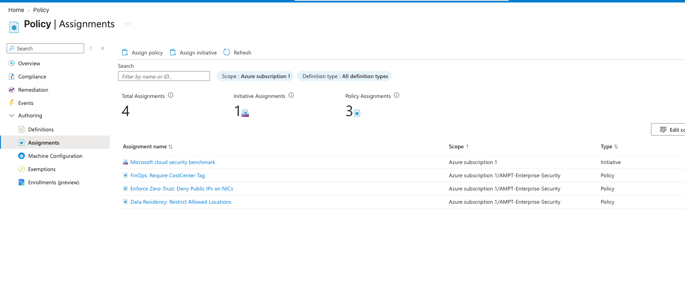

# Azure Enterprise Secure Landing Zone
**Zero-Trust, Infrastructure Security & GRC Foundation**

🚧 **Status:** Active Development
🎯 **Focus:** Azure Infrastructure Security • Governance • GRC • DevSecOps • Cloud Security

## Objective
This repository implements an enterprise-style secure cloud foundation in Microsoft Azure using modular Infrastructure as Code (IaC) with Bicep.

The architecture models security and governance requirements commonly found in regulated environments such as banking and financial services, using principles from the Microsoft Cloud Adoption Framework (CAF) and Zero Trust.

The goal is to demonstrate how a secure Azure foundation can be designed with security controls built into the infrastructure layer rather than added after deployment.

**The project focuses on:**
* Identity-based access control
* Network segmentation and centralized traffic inspection
* Private connectivity for sensitive Azure services
* Infrastructure-level governance and policy enforcement
* Centralized logging and security monitoring
* Continuous compliance assessment
* Threat detection and Day 2 operational controls
* Automated infrastructure deployment and change validation

> **Note:** This is a security engineering and cyber risk lab, not a production deployment. The implementation intentionally documents both security controls and their limitations, including cost, regional availability, licensing, and compliance gaps.

---

## 🏛 Architecture Overview

**Hub-Spoke Network Architecture**
A centralized Hub VNet provides shared security and management services while workload environments are isolated into separate Spoke VNets. VNet peering and controlled forwarding establish explicit transit boundaries between the environments.

**Centralized Traffic Inspection**
Workload egress and selected cross-network traffic are routed through Azure Firewall using User-Defined Routes (UDRs). The architecture combines:
* Azure Firewall for centralized traffic filtering
* FQDN-based application/network filtering
* NSGs for subnet-level micro-segmentation
* Explicit routing boundaries
* Threat protection capabilities where supported by the deployed Firewall SKU

**Identity & Access Management**
Compute workloads use System-Assigned Managed Identities to reduce dependency on stored credentials. Azure Key Vault access is designed around Azure RBAC, while a documented break-glass strategy provides emergency access procedures for identity-control-plane outages.

**Private Connectivity**
Sensitive Azure services such as Key Vault are accessed through Azure Private Link / Private Endpoints with associated Private DNS Zones. Public network access can be disabled so that data-plane access occurs through the private endpoint rather than the public endpoint.

**Observability by Design**
A centralized Log Analytics Workspace (LAW) provides the foundation for security and operational telemetry. Diagnostic settings are configured across supported resources so that relevant platform logs can be centralized for monitoring and downstream Microsoft Sentinel integration.

**Governance as Code**
Subscription-level Azure Policy controls are deployed through Bicep to establish preventative guardrails such as:
* Allowed deployment regions
* Required resource tagging
* Restrictions on public IP exposure
* Security baseline enforcement
* Continuous compliance visibility

---

## 🏗 Infrastructure as Code Components

| Module Category | File | Security / Governance Feature |
| :--- | :--- | :--- |
| **Network** | `hub-vnet.bicep` | Central transit network housing Bastion and Firewall subnets |
| **Network** | `spoke-vnet.bicep` | Workload isolation with UDR-based routing to the Hub |
| **Network** | `firewall.bicep` | Centralized traffic inspection and FQDN filtering |
| **Network** | `nsg.bicep` | Default-deny micro-segmentation at the subnet boundary |
| **Network** | `peering.bicep` | Controlled VNet-to-VNet connectivity |
| **Governance** | `policies.bicep` | Preventative Azure Policy guardrails |
| **Security** | `keyvault.bicep` | Soft-delete, purge protection and Private Link isolation |
| **Security** | `law.bicep` | Centralized Log Analytics Workspace |
| **Compute** | `compute.bicep` | Managed identity, no public IP and resource locks |

---

## 🔒 Security Architecture Decisions

* **Decision 1 — Secure Parameterization:** Administrative credentials are handled using Bicep `@secure()` parameters to prevent sensitive values from being unnecessarily exposed through deployment metadata and logs.
* **Decision 2 — Automated Host Hardening:** The VM deployment uses the Azure Custom Script extension to enforce an immediate password-change requirement on the first interactive login. This demonstrates how host-level hardening controls can be incorporated directly into infrastructure deployment.
* **Decision 3 — Centralized Diagnostic Logging:** `Microsoft.Insights/diagnosticSettings` configurations are used across supported resources to centralize telemetry into the Log Analytics Workspace. *(Security principle: If critical infrastructure activity isn't observable, investigation and accountability become significantly harder.)*
* **Decision 4 — Layered Network Defense:** The architecture deliberately separates responsibilities between NSGs for subnet-level traffic control and micro-segmentation, and Azure Firewall for centralized traffic inspection, application/FQDN filtering and controlled egress.
* **Decision 5 — Private Link for Sensitive Services:** Azure Key Vault is isolated using a private endpoint and Private DNS configuration, with public network access disabled in the implemented configuration.
* **Decision 6 — Infrastructure Change Visibility:** The deployment workflow incorporates `az deployment sub what-if` to preview infrastructure changes before deployment. This creates a practical change-review mechanism for infrastructure modifications and supports controlled CI/CD workflows.

---

## 📁 Repository Structure

```text
Azure-Enterprise-Hardened-Secure-Landing-Zone/
├── .github/
│   └── workflows/
│       └── bicep-deploy.yml              # CI/CD and deployment validation
├── docs/
│   ├── Pre-Implementation-Audit.md       # Security / GRC assessment
│   ├── threat-model.md                   # STRIDE threat model
│   └── images/                           # Architecture and validation evidence
├── modules/
│   ├── network/
│   │   ├── hub-vnet.bicep                # The central transit hub
│   │   ├── spoke-vnet.bicep              # Contains Web Subnet & Data Subnet
│   │   ├── peering.bicep                 # The bridge between Hub and Spoke
│   │   ├── bastion.bicep                 # Secure OOBM access
│   │   ├── firewall.bicep                # Layer 7 Egress control
│   │   └── nsg.bicep                     # Layer 4 Internal traffic control
│   ├── compute/
│   │   └── compute.bicep                 # Deploys Ubuntu VM 1 (Web) and VM 2 (Data)
│   ├── governance/
│   │   └── policies.bicep                # Preventative Azure Policies
│   └── security/
│       ├── keyvault.bicep                # Private Link isolated secrets
│       └── law.bicep                     # Log Analytics Workspace
├── identity/
│   └── setup-break-glass.ps1             # BCP Emergency Access Script
├── monitoring/
│   └── Threat-Detection-Queries.kql      # Sentinel detection logic
├──.gitignore
├── bicepconfig.json                      # Code quality rules
├── deploy.sh                             # Local execution wrapper
├── main.bicep                            # The Orchestrator
└── main.parameters.json                  # Git-ignored environment parameters
```

## ⚔️ SecOps: Day 2 Operational & Governance Controls
Unlike a deployment-only IaC exercise, this project also explores the operational controls required after infrastructure exists.

Automated Threat Hunting: /monitoring/Threat-Detection-Queries.kql contains KQL-based detection logic for suspicious infrastructure changes, including unauthorized NSG modifications and Key Vault-related activity.

Business Continuity Planning: /identity/setup-break-glass.ps1 documents an emergency-access strategy using a dedicated cloud-only break-glass identity. The purpose is to preserve administrative access during scenarios such as Microsoft Entra ID authentication or Conditional Access failures.

Microsoft Defender for Cloud: The environment is evaluated through Microsoft Defender for Cloud to identify security posture weaknesses and prioritize remediation.

Encryption at Host: The architecture documents Azure Encryption at Host as an additional protection layer for VM host-level temporary disks and OS/data disk caches.

Secure Out-of-Band Management (Replacing JIT): Traditional Just-In-Time (JIT) VM access is often used to mitigate brute-force attacks on Public IPs. Because this architecture adheres to strict Zero-Trust principles, Public IPs were explicitly blocked via Azure Policy. Administrative access is instead handled entirely via Azure Bastion over TLS, rendering traditional JIT redundant and eliminating the public attack surface entirely.

Policy-as-Code: The environment uses the Microsoft Cloud Security Benchmark (MCSB) as a security baseline for evaluating configuration drift and identifying areas requiring remediation.

Continuous Compliance & GRC Reality
A key objective of the project is demonstrating that secure infrastructure deployment does not automatically equal compliance. The implemented baseline was evaluated against the Microsoft Cloud Security Benchmark, producing an initial compliance result of approximately 17% despite the infrastructure itself achieving approximately 78% general health in the evaluated environment.

The gap exposed practical GRC issues including:

Licensing-dependent security controls

Missing premium Defender capabilities

OS-level security requirements

Monitoring and agent requirements

Controls requiring additional operational processes

Rather than hiding these gaps, they are documented as accepted risks and remediation opportunities. This reflects a more realistic security engineering workflow: Deploy → Assess → Identify gaps → Accept or remediate risk → Reassess

## 🖥️ Visual Documentation
---
### Architecture Diagrams:
---

* **(IMG001- Image illustrates the Azure Resource Visualizer showing the Hub-Spoke architecture.)**
---

* **(IMG002- Image illustrates the VS Code Bicep visualizer showing infrastructure dependencies.)**
---
### Network Topology:
---

* **(IMG003- Image illustrates the Azure Network Watcher topology showing deployed network relationships.)**
---

* **(IMG004- Image illustrates the Azure Resource Group deployment confirmation.)**
---
### Secure Network Connectivity:
---

* **(IMG005- Image illustrates the Explicit inbound and outbound NSG deny rules.)**
---

* **(IMG006- Image illustrates the Key Vault configured with Private Link and public network access disabled.)**
---

* **(IMG007- Image illustrates VM administration through Azure Bastion.)**
---
### Security & Governance Validation:
---

* **(IMG008- Image illustrates the Defender for Cloud protection coverage.)**
---

* **(IMG009- Image illustrates the Azure Policy overview and security posture results.)**
---

* **(IMG010- Image illustrates the Policy and security benchmark assignments applied to the environment.)**
------

## 🚧 Challenges & Architectural Solutions

* **Regional Capacity Constraints:** The initial deployment encountered Standard_B2s vCPU quota constraints in the primary deployment region. The infrastructure was subsequently refactored for South India, with Azure Policy location guardrails updated accordingly.

* **Soft-Delete State Locks:** Iterative deployments exposed Azure Resource Manager lifecycle constraints associated with soft-delete retention for services such as Log Analytics Workspace and Key Vault. The deployment process was adapted to account for these resource lifecycle states rather than treating teardown and redeployment as instantaneous operations.

* **Asymmetric Routing & Bastion:** Forced-tunneling and default-deny network controls introduced connectivity challenges for Azure Bastion. The architecture required carefully scoped higher-priority NSG allow rules so that Bastion management traffic could function without bypassing the intended network security model.

## 📉 Known Limitations & Accepted Risks

* **Budget-Restricted CSPM:** Premium security capabilities such as Microsoft Defender for Servers Plan 2 were intentionally excluded to control development costs. This limits capabilities such as certain JIT and OS-level vulnerability-management features and contributed to the initial compliance gaps observed against the Microsoft Cloud Security Benchmark.

* **Single-Region Deployment:** The current implementation operates in the South India region. Although the design can provide zonal resilience where supported, it does not currently implement cross-region disaster recovery. A production Tier-1 architecture would require a secondary region and an explicit DR strategy.

* **Platform-Managed Keys:** The current implementation relies on Azure platform-managed encryption keys. A future financial-sector implementation could introduce Customer-Managed Keys (CMK) backed by Azure Key Vault / Managed HSM depending on regulatory and organizational requirements.

---
**Lab / Demonstration Environment Notice**
This project is designed as a security engineering laboratory and portfolio implementation. It should not be interpreted as a production-ready enterprise landing zone without additional controls around High availability, Disaster recovery, Identity lifecycle management, Privileged Identity Management, Secret rotation, Certificate lifecycle management, SIEM/SOAR operations, Formal change management, Incident response procedures, Production-grade monitoring, Cost management, and Regulatory validation.

---
## 🚀 Future Improvements

**1. OIDC-Based CI/CD:** Finalize GitHub Actions authentication using OIDC / workload identity federation rather than long-lived deployment credentials. Add a mandatory review/approval stage around infrastructure what-if results before production-style execution.

**2. Sentinel SOAR Integration:** Expand the existing KQL detections into automated response workflows using Microsoft Sentinel + Logic Apps. Potential responses include isolating compromised workloads, disabling compromised identities, revoking active sessions, or creating incident tickets.

**3. Customer-Managed Keys:** Introduce CMK-based encryption for selected workloads using Azure Key Vault or Managed HSM. This would demonstrate key lifecycle management and stronger cryptographic control for regulated workloads.

**4. Azure Front Door + WAF:** Introduce Azure Front Door and Web Application Firewall capabilities to provide an internet-facing application security layer ahead of the workload environment.

**5. Multi-Region Resilience:** Extend the architecture into a paired-region design with cross-region networking, backup strategy, recovery objectives, failover testing, and regional policy controls.

---
## 📌 Project Takeaways
This project demonstrates the principle that cloud security is not just about deploying secure resources. A mature cloud security architecture must connect:

Infrastructure → Identity → Network → Logging → Detection → Governance → Compliance → Operations

The most valuable outcome of the project was not achieving a perfect compliance score. It was identifying why a technically secure deployment can still fail governance requirements, documenting those gaps, and designing the next iteration around them.
