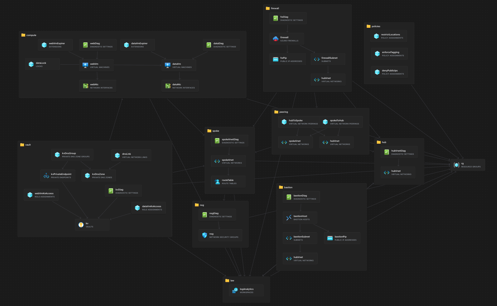
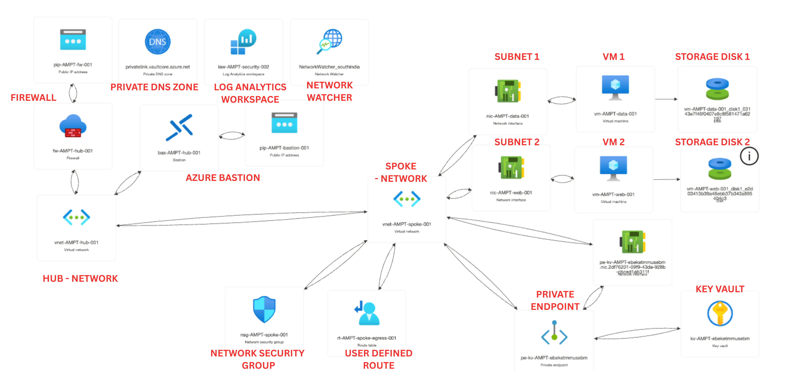
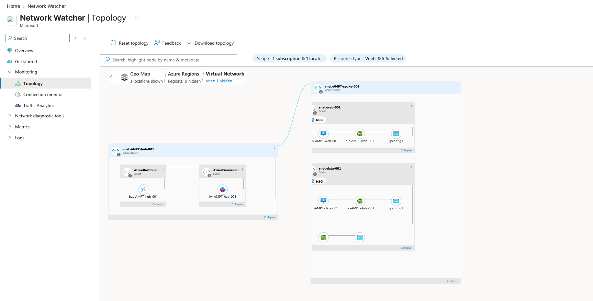
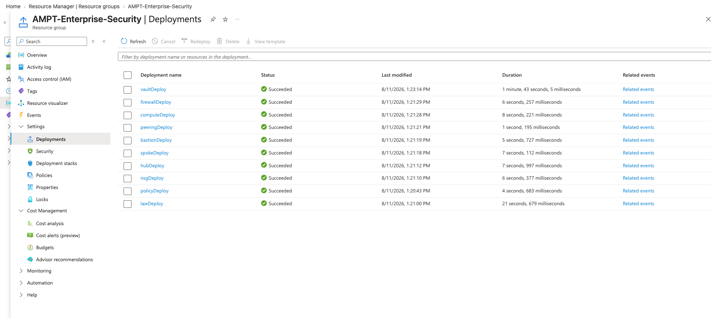
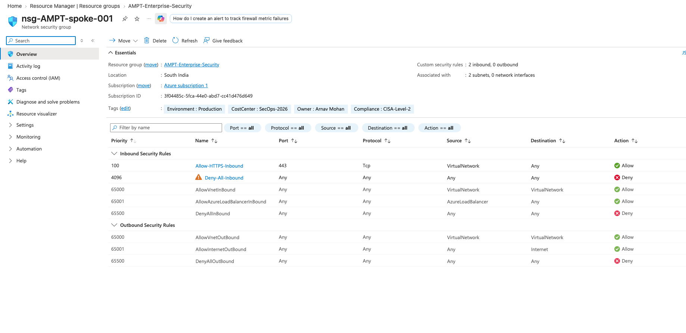
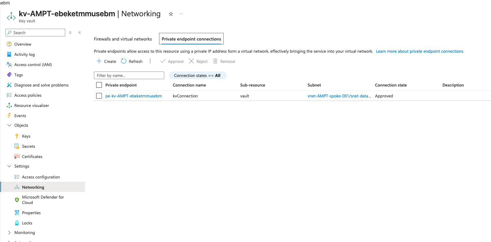
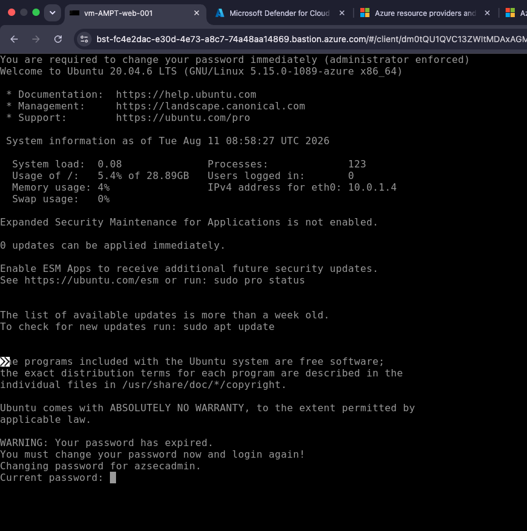
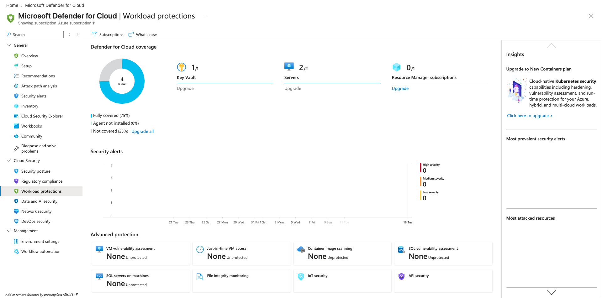
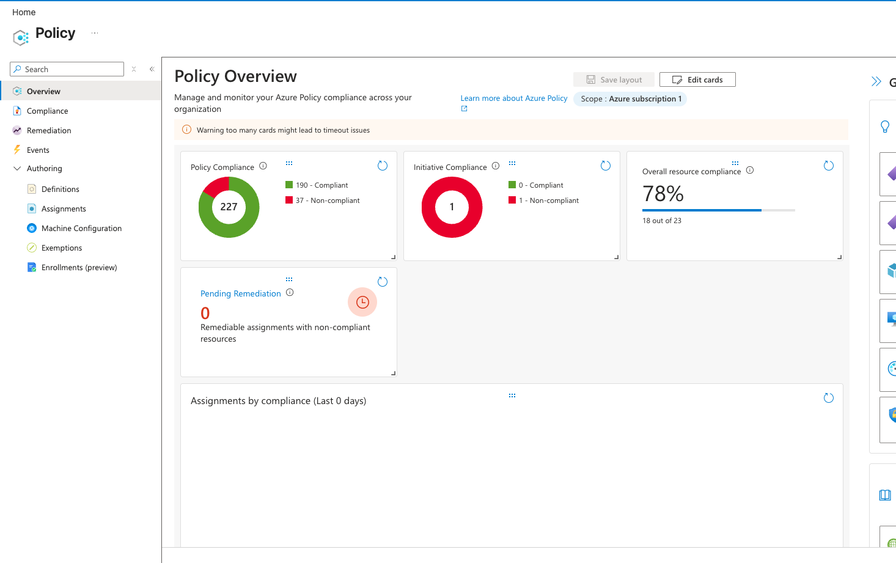
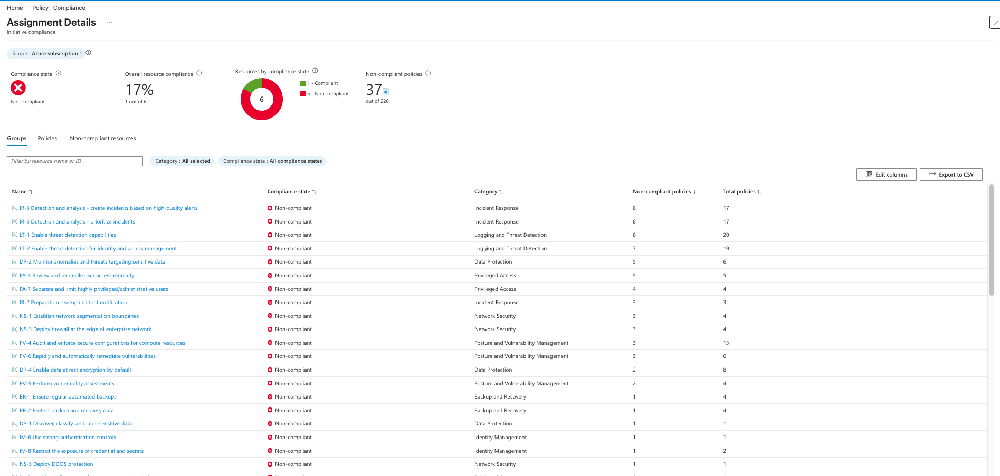

# Azure Enterprise Secure Landing Zone (Zero-Trust & GRC Foundation)

🚧 **Status:** Active Development | **Focus:** Infrastructure Security, CISA Audit Compliance, DevSecOps

### Objective

This repository deploys an **Enterprise-Grade Cloud Foundation** in Azure using modular Infrastructure as Code (Bicep). Designed for heavily **regulated environments** (Banking/Financial Services), it implements the **Microsoft Cloud Adoption Framework (CAF)** and **Zero-Trust architecture** to build a secure, immutable, and audited "Hardened Shell" for production workloads.

Beyond solving standard infrastructure deployment, this project serves as a comprehensive **Purple Team / Cyber Risk lab**, demonstrating Identity-based access, Layer 7 Perimeter Security, Continuous Compliance, and Automated Threat Hunting.

---

### 🏛 Architecture Overview

*   **Hub-Spoke Topology:** Centralized management plane (Hub) peered with workload environments (Spokes) using `allowForwardedTraffic` to enforce strict transit boundaries.
*   **Deep Packet Perimeter:** All egress and cross-spoke traffic is forced through an **Azure Firewall** via User-Defined Routes (UDRs), providing Layer 7 (Application) filtering and IDPS, moving beyond basic Layer 4 NSGs.
*   **Identity & Access (IAM):** System-Assigned Managed Identities for compute workloads, strict RBAC-only Key Vault access, and a documented "Break-Glass" strategy for Business Continuity during Entra ID outages.
*   **Private Connectivity:** Data plane isolation via Azure Private Link and Private DNS Zones. Critical assets (like Key Vault) are decoupled from the public internet entirely.
*   **Observability by Design:** Centralized Log Analytics Workspace (LAW). Every deployed resource is programmatically bound to a `diagnosticSettings` configuration, streaming audit logs to Microsoft Sentinel instantly.
*   **Governance as Code:** Subscription-level Azure Policies are enforced via Bicep to restrict deployment regions, mandate resource tagging, and explicitly block public IP creation on workload subnets.

---

### 🏗 Infrastructure as Code Components (Modules)

| Module Category | File | Security / Governance Feature |
| :--- | :--- | :--- |
| **Network** | `hub-vnet.bicep` | Central transit network housing Bastion and Firewall subnets. |
| **Network** | `spoke-vnet.bicep` | Workload isolation with UDR Forced Tunneling to the Hub. |
| **Network** | `firewall.bicep` | Layer 7 Deep Packet Inspection & FQDN egress filtering. |
| **Network** | `nsg.bicep` | "Default-Deny" micro-segmentation at the subnet boundary. |
| **Network** | `peering.bicep` | Decoupled deployment ensuring secure, routed VNet transit. |
| **Governance** | `policies.bicep` | Preventative guardrails (Deny Public IPs, Allowed locations). |
| **Security** | `keyvault.bicep` | Soft-delete, Purge Protection, and Private Link isolation. |
| **Security** | `law.bicep` | Centralized Log Analytics Workspace for Sentinel ingestion. |
| **Compute** | `compute.bicep` | System Identity, No Public IP, and `CanNotDelete` Resource Locks. |

---

### 🔒 Security Architecture Decisions

*   **Decision 1: Secure Parameterization:** Leveraged `@secure()` decorators for all administrative credentials to ensure zero exposure in deployment logs and metadata.
*   **Decision 2: Automated Hardening:** Utilized the `CustomScript` extension to enforce an immediate password change policy (`chage -d 0`) upon the first interactive login, mitigating 'Day 1' credential risks.
*   **Decision 3: Ubiquitous Diagnostic Pipes:** Implemented `Microsoft.Insights/diagnosticSettings` across all modules. If a resource is deployed, its telemetry is inherently piped to the central LAW. *(Rationale: "If it isn't logged, it didn't happen.")*
*   **Decision 4: Layered Perimeter Defense:** Implemented Azure Firewall over standalone NSGs. While NSGs handle internal micro-segmentation, the Firewall handles deep packet inspection and outbound FQDN filtering, meeting strict enterprise data exfiltration requirements.
*   **Decision 5: Private Link Integration:** Bypassed the public internet entirely for Key Vault access by implementing Azure Private Link. This ensures that even with valid credentials, the vault remains physically unreachable from outside the private VNet mesh.
*   **Decision 6: The 'Kill Switch' Pipeline:** Integrated `az deployment sub what-if` into the GitHub Actions workflow. Infrastructure modifications generate a Delta report before tenant execution, ensuring strict Change Advisory Board (CAB) visibility.

---

### 📁 Repository Structure

```text
Repo: Azure-Enterprise-Hardened-Secure-Landing-Zone/
├── .github/
│   └── workflows/
│       └── bicep-deploy.yml              # CI/CD: The "Kill Switch" & What-If
├── docs/                                 
│   ├── Pre-Implementation-Audit.md       # CISA / ISO 27001 Compliance Report
│   ├── threat-model.md                   # STRIDE Threat Model documentation
│   └── images/                           # Visual proof and diagrams
├── modules/
│   ├── network/
│   │   ├── hub-vnet.bicep                # The central transit hub
│   │   ├── spoke-vnet.bicep              # Contains Web Subnet & Data Subnet
│   │   ├── peering.bicep                 # The bridge between Hub and Spoke
│   │   ├── bastion.bicep                 # Secure OOBM access
│   │   ├── firewall.bicep                # Layer 7 Egress control
│   │   └── nsg.bicep                     # Layer 4 Internal traffic control
│   ├── compute/                    
│   │   └── compute.bicep                 # Deploys Ubuntu VM 1 (Web) and VM 2 (Data)
│   ├── governance/
│   │   └── policies.bicep                # Preventative Azure Policies 
│   ├── security/
│   │   ├── keyvault.bicep                # Private Link isolated secrets
│   │   └── law.bicep                     # Log Analytics Workspace
├── identity/                                                  
│   └── setup-break-glass.ps1             # BCP Emergency Access Script         
├── monitoring/                                             
│   └── Threat-Detection-Queries.kql      # Sentinel detection logic
├── bicepconfig.json                      # Code quality rules
├── deploy.sh                             # Local execution wrapper
├── main.bicep                            # The Orchestrator
└── main.parameters.json                  # Local environment variables (GitIgnored)
```

## ⚔️ SecOps: Day 2 Operational & Governance Configurations
Unlike traditional deployments, this lab focuses on Operational Sustainability using the following "Modern SecOps" pillars:

Automated Threat Hunting: See /monitoring/Threat-Detection-Queries.kql for custom Kusto Query Language (KQL) rules designed to detect unauthorized NSG modifications and Key Vault access policy tampering via Sentinel.

Business Continuity Planning (BCP): See /identity/setup-break-glass.ps1 for the deployment logic of a Cloud-Only Emergency Access Account, intentionally bypassing Conditional Access to prevent lockout during Entra ID outages.

Microsoft Defender for Cloud (CSPM): Automated onboarding to the Defender for Cloud portal to monitor the "Security Score" and remediate high-risk findings (like open management ports).

Encryption at Host: Utilizing the modern successor to Azure Disk Encryption (ADE) to ensure temporary disks, OS caches, and data disks are encrypted at the source with zero performance overhead.

Adaptive Network Hardening (JIT): Documentation for implementing Just-In-Time (JIT) access. This ensures that management ports (22/3389) are "Closed by Default" and only opened via a time-limited, RBAC-approved request.

Policy-as-Code: Assigning the "Azure Security Benchmark (v4)" initiative to dynamically flag any resource that drifts from the security baseline as "Non-Compliant."


## Visual Documentation 

### Architecture Diagrams:
 

* **(IMG001- Image illustrates the VS Code visualizer overview of the Hub-Spoke network)**


* **(IMG002- Image illustrates the Azure visualizer diagram overview of the Hub-Spoke network)**

### Network Topology:


* **(IMG003- Image illustrates the Azure Network Watcher Topology)**


* **(IMG004- Image illustrates the Azure Resource Group Deployment Overview)**

### Secure Network Connectivity:


* **(IMG005- Image illustrates the Network Security Group Inbound/Outbound Explicit Deny Rules)**


* **(IMG006- Image illustrates the Key Vault isolated via Azure Private Link with Public Network Access disabled)**


* **(IMG006- Image illustrates the Key Vault isolated via Azure Private Link with Public Network Access disabled)**

### Security & Governance Validation:


* **(IMG006- Image illustrates the Key Vault isolated via Azure Private Link with Public Network Access disabled)**


* **(IMG006- Image illustrates the Key Vault isolated via Azure Private Link with Public Network Access disabled)**


* **(IMG006- Image illustrates the Key Vault isolated via Azure Private Link with Public Network Access disabled)**
---
