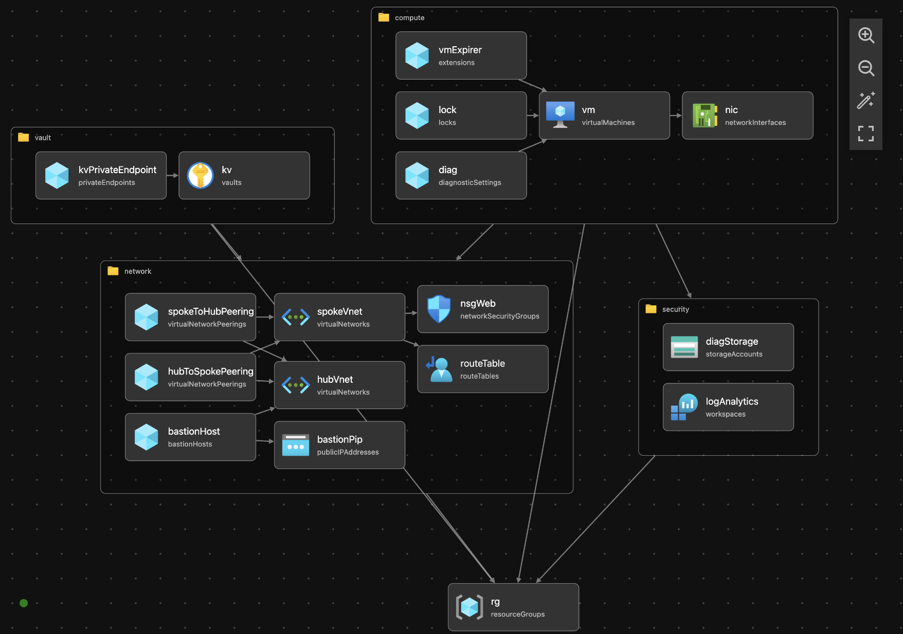
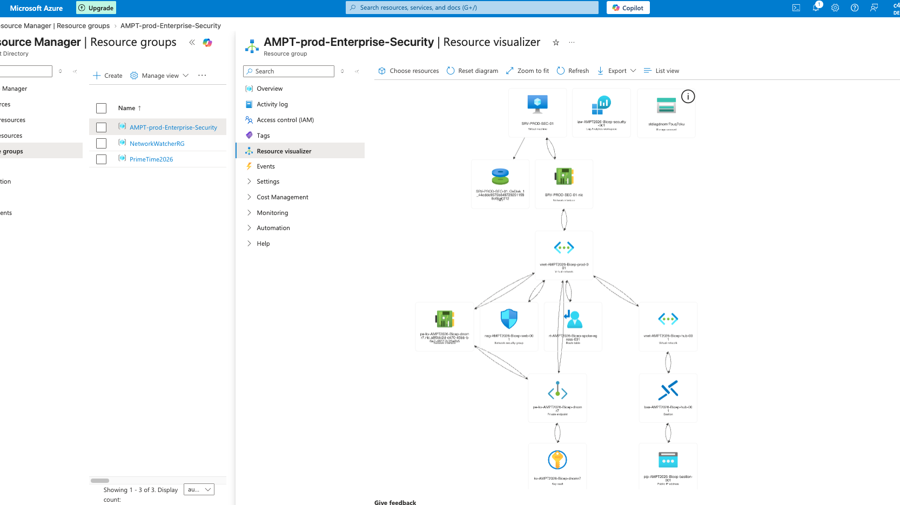
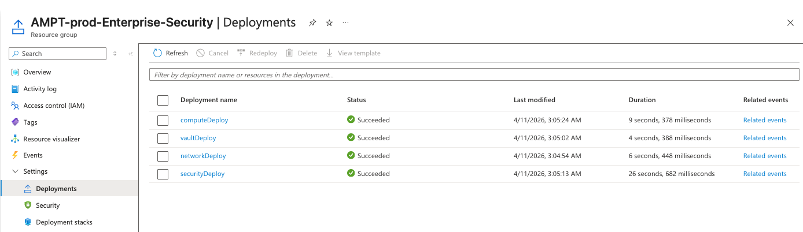
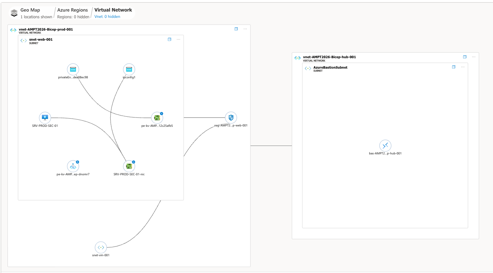
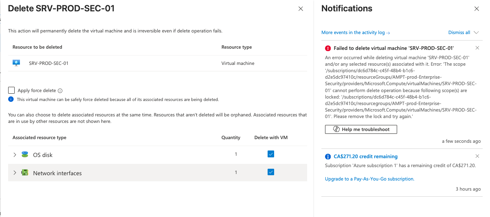
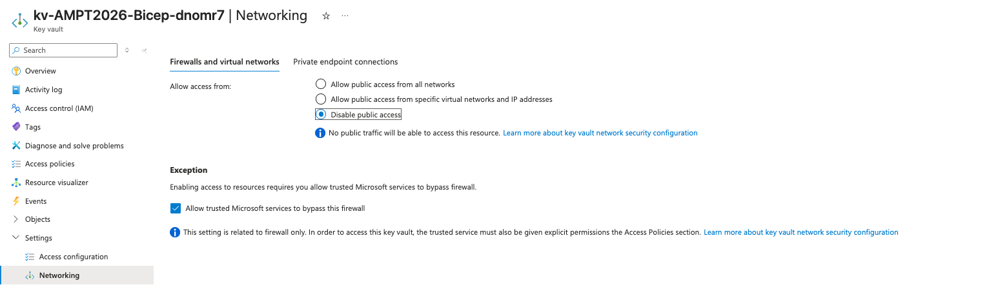

# Azure Secure Landing Zone: Enterprise Risk & Governance Foundation

### Objective

This repository deploys an **Enterprise-Grade Cloud Foundation** in Azure using modular Infrastructure as Code (Bicep). Designed for heavily **regulated environments** (Banking/Financial Services), it implements the **Microsoft Cloud Adoption Framework (CAF)** and **Zero-Trust architecture** to build a secure, immutable, and audited "Hardened Shell" for production workloads.

Beyond solving the standard infrastructure deployment, this project also serves as a comprehensive **Purple Team / Cyber Risk lab**, demonstrating Identity-based access, Layer 7 Perimeter Security, Continuous Compliance, and Automated Threat Hunting.

### Architecture Overview:

* **Hub-Spoke Topology:** Centralized management plane (Hub) peered with workload environments (Spokes) using ``` allowForwardedTraffic ``` to enforce strict transit boundaries.
* **Deep Packet Perimeter:** All egress and cross-spoke traffic is forced through an Azure Firewall via User-Defined Routes (UDRs), providing Layer 7 (Application) filtering and IDPS, moving beyond basic Layer 4 NSGs.
* **Identity & Access (IAM):** System-Assigned Managed Identities for compute, strict RBAC-only Key Vault access, and a documented "Break-Glass" strategy for Business Continuity during Entra ID outages.
* **Private Connectivity:** Data plane isolation via Azure Private Link and Private DNS Zones. Critical assets (like Key Vault) are decoupled from the public internet entirely.
* **Observability by Design:** Centralized Log Analytics Workspace (LAW). Every deployed resource is programmatically bound to a diagnosticSettings configuration, streaming audit logs to Microsoft Sentinel instantly.
* **Governance as Code:** Subscription-level Azure Policies are enforced via Bicep to restrict deployment regions, mandate resource tagging, and enforce MFA compliance.

* **Perimeter Security:** Forced tunneling through Azure Firewall for egress and cross-spoke traffic via User-Defined Routes (UDRs), providing Layer 7 (Application) filtering and IDPS, along with Layer 4 "Default-Deny" NSGs.
* **Identity & Access (IAM):** System-Assigned Managed Identity for VMs and RBAC-only access for Key Vault.
* **Private Connectivity:** Key Vault isolation via Private Endpoints (Private Link).
* **Observability:** Centralized Log Analytics Workspace (LAW) with diagnostic pipes from all resources.

### Infrastructure as Code Components (Modules)

| Module | Purpose | Security Feature |
| -------- | -------- | -------- |
| firewall.bicep | Network Security - Firewall | Layer 7 Deep Packet Inspection & FQDN egress filtering. |
| nsg.bicep | Network Security - NSG | "Default-Deny" micro-segmentation at the subnet level. |
| peering.bicep | Network Security - Vnet | Decoupled deployment ensuring secure, routed VNet transit. |
| policies.bicep | Governance - Policy | Preventative guardrails (Allowed locations, Tagging taxonomy). |
| keyvault.bicep | Security - Access | Soft-delete, Purge Protection, and Private Link isolation. |
| law.bicep | Security - Logs | Centralized Log Analytics Workspace for Sentinel ingestion. |
| -------- | -------- | -------- |
|security-center.bicep	| Central Logging	| Log Analytics Workspace (LAW) & Immutable Diag Storage. |
|vnet-hub-spoke.bicep	| Network Mesh	| Hub-Spoke Peering, Bastion Host, and UDR Route Tables. |
|vault.bicep	| Secret Management	| Private Endpoint (No Public Access) & RBAC Authorization. |
|compute-hardened.bicep	| Workload Protection	| System Identity, No Public IP, and CanNotDelete Resource Locks. |

### Security Architecture Decisions

* **Decision 1:** Secure Parameterization: Leveraged @secure() decorators for administrative credentials and utilized the CustomScript extension (chage -d 0) to enforce an immediate password change policy upon first interactive login, mitigating 'Day 1' credential risks.

* **Decision 2:** Ubiquitous Diagnostic Pipes: Implemented Microsoft.Insights/diagnosticSettings across all modules. If a resource is deployed, its telemetry is inherently piped to the central LAW. (Rationale: "If it isn't logged, it didn't happen.")

* **Decision 3:** The 'Kill Switch' Pipeline: Integrated az deployment sub what-if into the GitHub Actions workflow. Infrastructure modifications generate a Delta report before tenant execution, ensuring strict Change Advisory Board (CAB) visibility.

* **Decision 4:** Layered Perimeter Defense: Implemented Azure Firewall over standalone NSGs. While NSGs handle internal micro-segmentation, the Firewall handles deep packet inspection and outbound FQDN filtering, meeting enterprise data exfiltration requirements.

* **Decision 1:** Secure Parameterization. "Used @secure() decorators for all administrative credentials to ensure zero exposure in deployment logs and metadata."

* **Decision 2:** Automated Hardening. "Leveraged the CustomScript extension to enforce an immediate password change policy (chage -d 0) upon the first interactive login, mitigating 'Day 1' credential risks."

* **Decision 3:** Observability-by-Design. "Every compute resource is deployed with a pre-configured diagnostic pipe to a centralized Log Analytics Workspace for immediate SIEM ingestion."

* **Decision 4:** Private Link Integration. "Bypassed the public internet entirely for Key Vault access by implementing Azure Private Link. This ensures that even if an attacker had valid credentials, the vault remains physically unreachable from outside the private VNet mesh.

### Repository Structure

```
Repo: Azure-Enterprise-Hardened-Secure-Landing-Zone/
├── .github/
│   └── workflows/
│       └── bicep-deploy.yml          	# UPDATED: Now includes linting and What-If analysis
├── docs/                          	       		# NEW: The "Audit Evidence" & Architecture
│   ├── threat-model.md              		# Threat Model & Firewall vs NSG logic
│   └── architecture-diagram.png  
├── modules/
│   ├── network/
│   │   ├── hub-vnet.bicep
│   │   ├── spoke-vnet.bicep
│   │   ├── peering.bicep         		# NEW: Dedicated peering module
│   │   ├── firewall.bicep         		# Includes Diagnostic Settings
│   │   └── nsg.bicep             		# Includes Diagnostic Settings
│   ├── compute/                    
│   │   └── compute.bicep
│   ├── governance/
│   │   └── policies.bicep
│   ├── security/
│   │   ├── keyvault.bicep        		# Includes Diagnostic Settings
│   │   └── law.bicep             
├── identity/                                                  # NEW: Identity Management
│   └── setup-break-glass.ps1                      # Script & instructions for BCP emergency access
├── monitoring/                                             # NEW: Sentinel & Threat Hunting
│   └── Threat-Detection-Queries.kql           # KQL rules for NSG/Key Vault tampering
├── bicepconfig.json              	            # NEW: Linter rules & registry config
├── main.bicep                    
├── main.parameters.json          
└── README.md                                         # The "Audit Evidence" documentation
```


### How to Deploy:

```bash

az login

az stack sub create \
  --name "AMPT-2026-Foundation-Stack" \
  --location centralindia \
  --template-file main.bicep \
  --parameters parameters.json \
  --deny-settings-mode "denyDelete"     # This prevents manual deletion in portal!
  
* input the username and password when prompted
```

## SecOps: Day 2 Operational & Governance Configurations
Beyond initial deployment, this repository provides assets for active defense, resilience, and continuous compliance:

Automated Threat Hunting: See /monitoring/Threat-Detection-Queries.kql for custom Kusto Query Language (KQL) rules designed to detect unauthorized NSG modifications and Key Vault access policy tampering via Sentinel.

Business Continuity Planning (BCP): See /identity/setup-break-glass.ps1 for the deployment logic of a Cloud-Only Emergency Access Account, intentionally bypassing Conditional Access to prevent lockout during Entra ID outages.

Microsoft Defender for Cloud (CSPM): Built for automated onboarding to monitor the "Security Score" and actively remediate high-risk vulnerabilities.

Encryption at Host: Utilizing the modern successor to Azure Disk Encryption (ADE) to ensure temporary disks, OS caches, and data disks are encrypted at the source with zero performance overhead.

Policy-as-Code: Assigning the "Azure Security Benchmark (v4)" initiative to dynamically flag any resource that drifts from the security baseline as "Non-Compliant."

Beyond the Bicep deployment, this lab includes documented manual configurations for:

* **Microsoft Defender for Cloud:** Enabling security posture management (CSPM).
* **Just-In-Time (JIT) Access:** Restricting management ports via adaptive network hardening.
* **Azure Policy:** Assigning the "Azure Security Benchmark" for continuous compliance auditing.
* **Disk Encryption:** Implementing Azure Disk Encryption (ADE) via the Hardened Key Vault.

Unlike traditional deployments, this lab focuses on Operational Sustainability using the following "Modern SecOps" pillars:

* **Encryption at Host (The ADE Successor):** Moving beyond legacy ADE, this architecture utilizes Encryption at Host to ensure that temporary disks, OS caches, and data disks are encrypted at the source with zero performance impact.
* **Microsoft Defender for Cloud (CSPM):** Automated onboarding to the Defender for Cloud portal to monitor the "Security Score" and remediate high-risk findings (like open management ports).
* **Adaptive Network Hardening (JIT):** Documentation for implementing Just-In-Time (JIT) access. This ensures that Port 22/3389 are "Closed by Default" and only opened via a time-limited, RBAC-approved request.
* **Policy-as-Code (Azure Security Benchmark):** Integrated guidance on assigning the ASB (v4) initiative to the Resource Group. This ensures any resource that drifts from the security baseline is flagged as "Non-Compliant" automatically.

## Visual Documentation

### Architecture Diagram (VS Code)
 

* **(IMG001- Diagram shows the Vscode visualizer diagram overview of the Hub-Spoke network.)**


* **(IMG002- Diagram shows the Azure visualizer diagram overview of the Hub-Spoke network.)**

### Network Watcher Topology:


* **(IMG003- Diagram shows the Azure Network Watcher Topology.)**

* **(IMG004- Diagram shows the Azure Resource Group overview.)**

### Resource Lock Verification (Lock Test): 


* **(IMG005- Diagram shows the Network Security group Inbound and Outbound rules.)**

### Private Link Verification: 


* **(IMG006- Diagram shows the Deletion Attempt on the Resource Group with Resource Lock.)**

### Key Vault (Managed Identity)


### NSG Flow 

---

### Azure Monitor

---

## Changes and Future Improvements


Project 1: The Secure Enterprise Landing Zone (The Architecture & GRC Blueprint)

What it is: A secure, production-ready Azure environment built via code, matching Microsoft Cloud Adoption Framework (CAF) best practices.

The Technical Build (AZ-104/AZ-500):

Deploy an Infrastructure as Code (IaC) template (using Bicep or Terraform) creating a Hub-and-Spoke VNet topology.

The Hub: Place an Azure Firewall and an Azure Bastion host here. Route all traffic from the spokes through the Hub firewall using User-Defined Routes (UDRs).

The Spokes: Create two separate spoke VNets. Spoke A hosts your application servers; Spoke B hosts your databases. Use Network Security Groups (NSGs) to strictly limit communication between them.

Identity (Microsoft Entra ID): Set up a simulated corporate directory. Configure a conditional access policy requiring Multi-Factor Authentication (MFA) for any administrative actions.

The Auditor’s Twist (CISA/SC-100) — This lands the job:

Create and assign a custom Azure Policy Initiative that automatically blocks the creation of any public IP addresses in the Spoke networks.

Write a formal 3-page Pre-Implementation Audit Report and post it on your GitHub repository. 

Explain how your landing zone architecture maps directly to the controls of ISO 27001 and NIST SP 800-53 (specifically addressing network segregation and least-privilege access).


